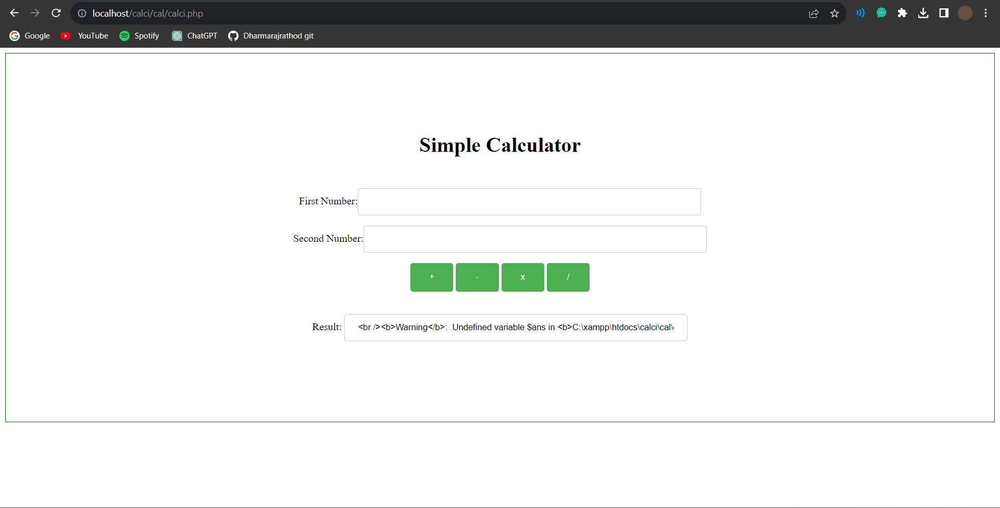

# PHP Calculator


The PHP Calculator is a simple web-based calculator application built using PHP, HTML, and CSS. It provides basic arithmetic operations such as addition, subtraction, multiplication, and division. This calculator is designed to be lightweight and easy to use, making it a great tool for quick calculations right in your browser.

## Features
- Addition: Add two or more numbers.
- Subtraction: Subtract one number from another.
- Multiplication: Multiply two or more numbers.
- Division: Divide one number by another.

## Installation
1. Clone this repository to your local machine or web server using the following command:
   ```bash
   git clone https://github.com/Dharmarajrathod/php-calculator.git
